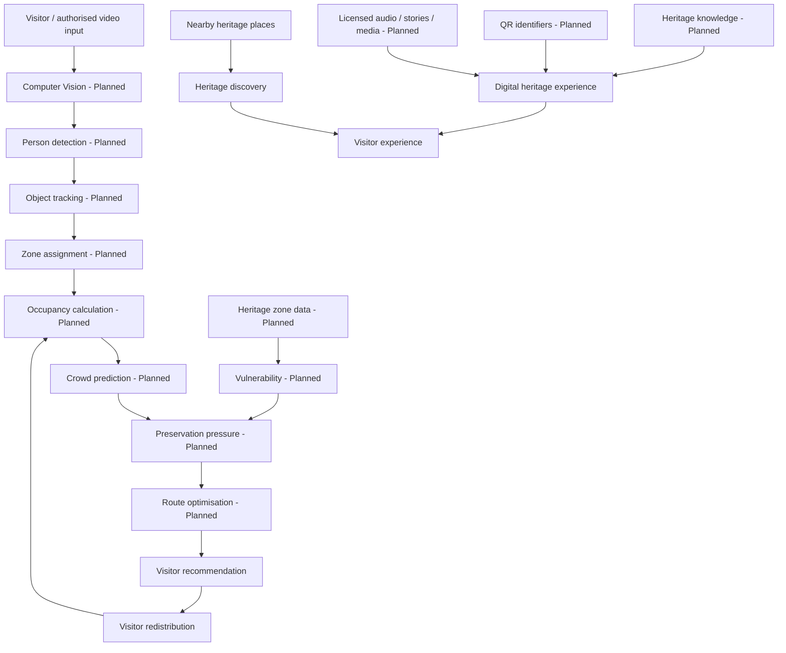

# Heritage India

> Preserve. Experience. Discover.

**Heritage India** is a conservation-aware heritage technology prototype for reducing excessive visitor pressure on vulnerable heritage zones while improving the visitor experience through digital heritage, living cultural knowledge, and nearby heritage discovery.

The intended platform brings together visitor monitoring, crowd prediction, heritage vulnerability, preservation pressure, route recommendations, QR-style heritage experiences, intangible cultural heritage, and nearby-place discovery. It is a **decision-support system**, not an autonomous conservation authority.

## Status at a glance

| Area | Current status |
| --- | --- |
| Responsive React frontend | **Implemented** |
| Homepage, content routes, dashboard and contact UI | **Implemented** |
| Dashboard crowd-surge interaction | **Prototype** (local UI state and mock values) |
| Heritage, zone and place data | **Prototype** (static mock data) |
| QR/audio experience | **Prototype** (visual play/pause state; no media file or QR service) |
| Backend, database, CCTV and computer vision | **Planned** |
| REST API and persistent content management | **Planned** |

## Problem statement

Heritage sites can experience uneven visitor distribution, crowding around popular attractions, pressure on sensitive areas, and limited visibility into near-term visitor growth. Visitors can also have limited access to fragile artifacts, living cultural knowledge, and nearby places of cultural significance.

Heritage India addresses both sides of that challenge:

- **Conservation:** make visitor pressure and zone sensitivity understandable to site managers.
- **Visitor experience:** offer considerate alternatives, digital experiences, and broader cultural discovery.

## Proposed solution

The future operational flow is:

```text
Visitor Input
      ↓
Person Detection → Tracking → Zone Assignment → Occupancy
      ↓                                      ↓
Crowd Prediction → Heritage Vulnerability → Preservation Pressure
      ↓
Dynamic Route Optimization → Visitor Redistribution → Recalculation
```

The visitor-experience layer complements the site-management flow:

```text
Heritage Site → Digital Heritage Experience → QR / Audio / Stories
                                             ↓
                                  Nearby Heritage Discovery
```

## Core features

| Feature | Description | Status |
| --- | --- | --- |
| Visitor monitoring | Detect and track visitors from video. | **Planned** |
| Zone occupancy | Estimate visitors per heritage zone. | **Prototype** (static dashboard values) |
| Crowd prediction | Estimate near-future occupancy. | **Prototype** (displayed simulated values) |
| Vulnerability | Zone-specific heritage sensitivity parameter. | **Prototype** (static mock values) |
| Preservation pressure | Explainable pressure-oriented view of zones. | **Prototype** (illustrative UI) |
| Dynamic routing | Recommend a lower-pressure alternative route. | **Prototype** (static recommendation) |
| Simulation mode | Toggle a crowd-surge scenario in the dashboard. | **Implemented** |
| QR heritage experience | Digital artifact experience interface. | **Prototype** |
| Audio experience | Visual 30-second Veena player state. | **Prototype** |
| Living Heritage | Songs, stories, crafts, recipes, and related categories. | **Prototype** |
| Nearby Heritage | Filterable nearby cultural places. | **Prototype** |
| Dashboard | Operational-style visitor-pressure view. | **Implemented** |

## System architecture

The implemented repository contains the frontend portion only. The following describes the intended full-system architecture; nodes beyond the React frontend are **Planned**.



## Technology stack

### Implemented frontend

- **React 19** with **TypeScript**
- **Vite 8** build tooling
- **React Router DOM** for client-side routing
- **Framer Motion** for restrained reveal and hero animations
- **Lucide React** for interface icons
- Custom CSS design system and responsive layouts

### Planned backend and data layer

- **Backend: Planned** — Python, FastAPI, REST endpoints, Pydantic, and domain services.
- **AI / Computer Vision: Planned** — authorised video input, person detection, tracking, zone mapping, visitor-flow analysis, and prediction.
- **SQLite: Planned** — persistent zones, metrics, routes, experiences, and nearby-place content.

No backend, database, Python environment, CCTV integration, model, or API endpoint currently exists in this repository.

## Project structure

```text
heritage-india/
├── src/
│   ├── assets/
│   │   └── temple-hero.png       # Local hero image
│   ├── data/
│   │   └── mock.ts               # Static places, experiences and zones
│   ├── services/
│   │   └── heritageService.ts    # Future API replacement boundary
│   ├── App.tsx                   # Routes, page views and reusable UI
│   ├── main.tsx                  # React entry point
│   ├── styles.css                # Design system and responsive styles
│   └── vite-env.d.ts
├── index.html                    # HTML, metadata and app mount point
├── package.json                  # Scripts and dependencies
├── tsconfig.json                 # TypeScript configuration
├── vite.config.ts                # Vite React configuration
├── .gitignore
└── README.md
```

## Frontend documentation

`src/main.tsx` mounts the application inside `BrowserRouter`. `src/App.tsx` currently contains the shared header/footer, reusable presentation helpers, the route views, contact success state, audio-player state, filters, and dashboard simulation toggle. `src/styles.css` provides the palette, typography, responsive breakpoints, focus states, and reduced-motion handling.

### Routes

| Route | Purpose |
| --- | --- |
| `/` | Editorial homepage with conservation, cultural discovery, process, and experience sections. |
| `/about` | Purpose and decision-support positioning. |
| `/how-it-works` | Conceptual future workflow. |
| `/heritage` | Browsable heritage-experience categories. |
| `/nearby` | Nearby places with category filters. |
| `/dashboard` | Mock operational dashboard and surge toggle. |
| `/contact` | Prototype contact form with local success state. |

### Data and service boundary

`src/data/mock.ts` is the source of static zones, places, Living Heritage cards, and experience categories. `src/services/heritageService.ts` exposes asynchronous `getZones`, `getNearbyPlaces`, `getHeritageItems`, and `getRecommendedRoute` functions. These presently return mock data and are deliberately separated so that their implementations can later call FastAPI without making presentation components depend directly on `fetch`.

> The current frontend uses mock/static data and is structured so that these data sources can later be replaced by FastAPI endpoints.

### Accessibility and design

The frontend uses semantic landmarks, labelled controls, focus styles, responsive single-column mobile layouts, image alternative text, and `prefers-reduced-motion` rules. Its visual system uses forest green, warm ivory, sand, terracotta, and muted gold; Cormorant Garamond is used for principal headings and Inter for UI/body text. The design intentionally avoids neon gradients, blue/purple/black AI palettes, glassmorphism, and futuristic visual effects.

## Preservation-pressure concept

The intended score combines current occupancy, capacity, predicted occupancy, visitor inflow, and heritage vulnerability; dwell or exposure time could later be added. The current interface displays demonstration values only—it does not calculate a scientific damage model.

**Occupancy** is the number or proportion of visitors in a zone. **Vulnerability** is the sensitivity of that zone to visitor pressure. **Preservation Pressure** is the proposed decision-support signal produced by considering them together.

For example:

```text
Ancient mural room     → high vulnerability
Historic courtyard     → medium vulnerability
Open garden            → low vulnerability
```

> Heritage vulnerability and Preservation Pressure values in the prototype are configurable demonstration parameters and should not be interpreted as authoritative conservation or structural-safety assessments.

> Vulnerability and pressure parameters require validation from heritage-conservation experts before real-world deployment.

## Route optimisation and closed loop

Heritage areas can eventually be represented as a graph: nodes for zones, entrances, exits, and attractions; edges for permitted paths. A future route cost could consider walking time, crowding, preservation pressure, vulnerability, capacity, and closures. Dijkstra or A* are possible **planned** algorithms; neither is implemented.

```text
Detect → Measure → Predict → Assess → Recommend → Redistribute → Measure again
```

The goal is not to stop at “Zone A is crowded,” but to support the next decision: what visitor flow should do given current and expected pressure, then observe the result and recalculate.

## QR and digital heritage experience

The current UI presents a Veena audio experience with an illustrative QR-style graphic and play/pause progress state. It does not generate scannable QR codes or play an audio asset yet.

The intended interaction is:

```text
Physical artifact → QR identifier → Digital experience → Audio / story / information
```

Future media must be public-domain, appropriately licensed Creative Commons, institutionally licensed, or self-created. Content records should retain source and licence metadata; copyrighted media must not be copied from random websites for redistribution.

## Intangible cultural heritage and nearby discovery

The prototype includes categories for local songs, folk stories, traditional recipes, agricultural practices, festivals, rituals, crafts, traditional occupations, and garments. These are intended to complement physical sites with living cultural knowledge.

Nearby discovery currently shows mock Thanjavur-area examples and filters by category. A future recommendation system may weigh distance, travel time, cultural relevance, category, visit duration, available time, and visitor pressure—not merely tourism popularity.

## Planned backend

The following is a **planned**, not implemented, FastAPI structure:

```text
backend/
├── app/
│   ├── main.py
│   ├── api/
│   ├── models/
│   ├── schemas/
│   ├── services/
│   ├── core/
│   └── utils/
├── tests/
├── requirements.txt
└── .env.example
```

The frontend should communicate through its service layer; it must not access SQLite directly.

```text
React → API service layer → FastAPI → Python services → SQLite
```

### Planned API

These endpoints are architecture targets only; none currently exist.

| Method | Endpoint | Description |
| --- | --- | --- |
| GET | `/api/zones` | Get heritage zones. |
| GET | `/api/visitors` | Get visitor metrics. |
| GET | `/api/pressure` | Get preservation-pressure values. |
| GET | `/api/routes` | Get route recommendations. |
| GET | `/api/heritage` | Get heritage experiences. |
| GET | `/api/places` | Get nearby places. |
| POST | `/api/simulation` | Run a simulation scenario. |

### Proposed database schema

SQLite is **Planned**. Likely entities include:

| Entity | Representative fields |
| --- | --- |
| `HeritageSite` | id, name, description, location, region |
| `Zone` | id, site_id, name, capacity, vulnerability_score |
| `VisitorMetrics` | id, zone_id, timestamp, occupancy, inflow, outflow |
| `PressureRecord` | id, zone_id, timestamp, occupancy, predicted_occupancy, vulnerability, pressure_score |
| `HeritageExperience` | id, title, category, description, media_url, audio_url, duration, source, license |
| `NearbyPlace` | id, name, location, distance, category, estimated_visit_duration |

These are proposed data models, not existing tables.

## AI / computer-vision integration plan

The future pipeline may use recorded video or authorised RTSP streams:

```text
RTSP / video → frame processing → person detection → object tracking
→ zone mapping → occupancy → time-series prediction → preservation pressure
```

YOLO, tracking methods, exact zone-calibration approach, and prediction model selection are all **Planned**. Any camera deployment must have appropriate authority approval and privacy controls.

## Simulation mode and demo flow

On `/dashboard`, select **Simulate Crowd Surge** to change the mock Main Monument occupancy, headline metrics, and zone presentation. Select it again to reset. Range inputs are visual prototype controls at this stage; their values are not connected to the calculation.

### Internal Round Demo

1. Open the dashboard in its normal state.
2. Explain mock occupancy, vulnerability, and the route panel.
3. Trigger **Simulate Crowd Surge**.
4. Point out the higher Main Monument occupancy and predicted-overload indicator.
5. Explain that a vulnerable, crowded zone should receive a higher pressure signal.
6. Show the illustrative lower-pressure route.
7. Open the heritage page and toggle an experience category.
8. Demonstrate the audio player state.
9. Open Nearby Places and apply a category filter.

## Local development

### Prerequisites

- Node.js (a current LTS release is recommended)
- npm

Python, FastAPI, SQLite, and model dependencies are not required for the current frontend because they are not yet in the repository.

```bash
npm install
npm run dev
```

Vite will print the local URL, normally `http://localhost:5173`.

Create a production build:

```bash
npm run build
npm run preview
```

## Environment variables

There are no required environment variables in the current implementation. A future integration may use a public frontend setting such as:

```env
# Planned frontend configuration
VITE_API_BASE_URL=http://localhost:8000

# Planned backend configuration
DATABASE_URL=sqlite:///./heritage.db
```

Do not commit API keys, private camera URLs, or real credentials.

## Security, privacy, and content responsibility

The following controls are **Future** work before any deployment involving live sites or cameras:

- Handle CCTV data responsibly and minimise personally identifiable information.
- Prefer anonymised visitor metrics where possible.
- Restrict camera access and secure API endpoints.
- Add authentication and authorisation.
- Validate uploaded media and protect environment variables.
- Obtain site-authority and institutional approval.

Heritage media must respect copyright, licensing, attribution, cultural ownership, and institutional permissions. Record source and licence metadata for all content.

## Limitations

- The repository is frontend-only.
- Zone, pressure, visitor, heritage, and place data are static mock values.
- The simulation is a UI demonstration, not a predictive model.
- There is no live CCTV, detection, tracking, route algorithm, QR generation, audio playback, API, database, or content-management system.
- Vulnerability and pressure values are not scientifically validated.
- Heritage content and media still require authoritative validation and verified licences.

## Roadmap

1. **Phase 1 — Frontend prototype:** complete responsive UI, mock data, dashboard, simulation, experience and discovery views. *(Current phase.)*
2. **Phase 2 — Backend:** FastAPI, REST API, SQLite, and content management.
3. **Phase 3 — Computer vision:** authorised camera/video pipeline, detection, tracking, and zone mapping.
4. **Phase 4 — Prediction:** visitor-flow and overload prediction.
5. **Phase 5 — Optimisation:** route optimisation and closed-loop redistribution.
6. **Phase 6 — Responsible deployment:** authority and expert validation, privacy controls, camera integration, and production operations.

## Research positioning

This project does not claim to have invented crowd detection, CCTV monitoring, GIS, route optimisation, QR museum experiences, digital heritage, or intangible-heritage archives. Its proposed contribution is the careful integration of **visitor monitoring + prediction + heritage vulnerability + preservation pressure + dynamic routing + digital heritage experience** into one platform.

> The platform is intended as a decision-support system for heritage-site managers, not as an autonomous authority for declaring sites unsafe or making conservation decisions.

## Contributing

1. Create a branch using the `codex/` prefix or your team convention.
2. Make focused changes and keep mock data/service boundaries intact.
3. Run `npm run build` before submitting changes.
4. Open a pull request with a concise description and visual screenshots for UI work.

## Project hygiene

The existing `.gitignore` excludes `node_modules/`, `dist/`, `.npm-cache/`, TypeScript build info, and Vite cache files. Do not commit:

```text
.env
.venv/
__pycache__/
*.db
large video files
private camera streams
secret keys
```

## Licence

**License: Not yet specified.**

## Sources and attribution

The project includes one local generated hero image in `src/assets/temple-hero.png`. Formal external heritage, media, and research-source lists have not yet been added.

**Sources and Attribution: To be added as external heritage/media datasets are integrated.**
